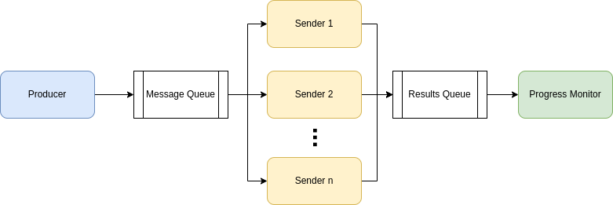

# Summary
The general architecture for the project is shown in this diagram:

There is one producer, which publishes its messages to a RabbitMQ queue. Those messages are distributed among `n` senders, which read from that RabbitMQ queue and publish their results (success and wait time) to a different queue. Finally, the single progress monitor reads from that queue.

There are different binaries for producers, progress monitors, and senders, and each binary is run in its own Docker container using docker compose (where `n` containers will be spun up for `n` senders, 1 per sender). A RabbitMQ container is also brought up using docker compose, and it is accessible to all other containers since they all share the same network (by default).

## System Dependencies
To run the project, you should be on a Linux machine with GNU make, Docker engine ([docs](https://docs.docker.com/engine/install/)), and the Docker compose plugin ([docs](https://docs.docker.com/compose/install/linux/)) installed.

# Running
To run the project, follow these steps:

1. Modify `config.json` with the desired config values for each component. The configuration spec is defined below
2. Navigate to the `AnalogGarage` folder and run `make run`. This will:
    1. run `bin/generate_docker_compose` to generate a `docker-compose.yaml` file where the config values specified in `config.json` are passed in via environment variables to the appropriate binaries
    2. build the production Docker image with the `analog_garage_test` package installed
    3. run `docker compose up` to bring up the producer, progress monitor, senders, and RabbitMQ

## Configuration Spec
The allowed keys are as follows:
  - `producer` (object)
    - `num_messages` (int): the number of messages the producer should generate and queue
  - `progress_monitor` (object)
    - `kind` (string): the kind of progress monitor to create. Each option has different config options that should also be included. Options and their companion options are:
        - `file`: outputs the status to a file-like object
            - `output_location` (str): Either a file path, `stdout`, or `stderr`
    - `refresh_secs` (float): the number of seconds between each refresh
  - `sender` (list)
    - `mean_wait_time` (float): the average time in seconds the sender should wait before considering a message handled
    - `failure_rate` (float): the proportion of messages between 0.0 and 1.0 that the sender should fail to handle

# Development Workflow
You can run `make develop` to get a shell into the test Docker image. This will build the image and mount in the source code and tests. All the expected development executables (pytest, coverage, black, mypy, etc) will be on the path.

There are also separate testing and linting targets that can be used instead of `make develop`.

## Testing
To run unit tests, run `make test`. This will run `pytest` via `coverage`, then print the coverage report.

## Linting
Similar to the `test` target, the linting targets will mount in the code and run the appropriate linter, modifying files if necessary. The available linting targets are: `black`, `isort`, `mypy`, `lint`

## Adding build or runtime dependencies
To add a new dependency to the project, add it to either `requirements/requirements-dev.in` or `requirements/requirements.in`, then run `make requirements` to generate the correct `requirements.txt` file. Next time the relevant Docker image is built, the new requirements will be installed.

For non-Python dependencies, the `Dockerfile` should be modified to install packages in the appropriate image stage.

# Remaining Work

- better config handling
  - use `jsonschema` to define and validate spec
  - write a library to handle pulling expected config values from env vars, applying defaults if specified, and raising a clear error if any config is missing or wrong
- other types of progress monitors
  - web-based using flask
- figure out ownership/permissions issues that result from running linters
  - docker user is root so if e.g. black updates a file, that file becomes owned by root
  - but changing docker user to user with same uid/gid as host machine causes issues with pip
- figure out mypy issues (error: Skipping analyzing "analog_garage_test.lib": module is installed, but missing library stubs or py.typed marker  [import-untyped])
  - this might be an issue with newer versions of setuptools (https://github.com/python/mypy/issues/13392) but we need setuptools >= 64.0 to be able to run `pip install -e .` without a `setup.py` file ([changelog](https://setuptools.pypa.io/en/latest/history.html#v64-0-0))
  - some workarounds documented [here](https://microsoft.github.io/pyright/#/import-resolution?id=editable-installs)
